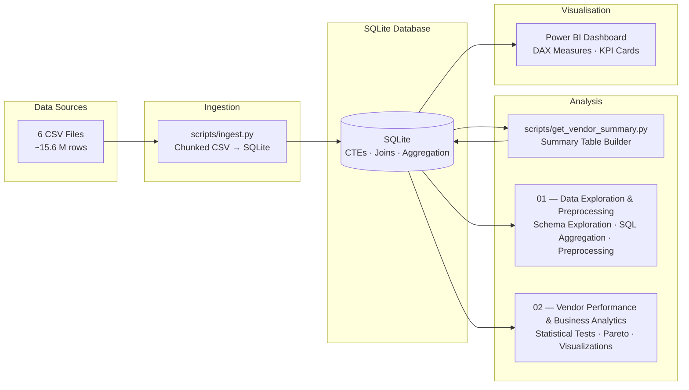
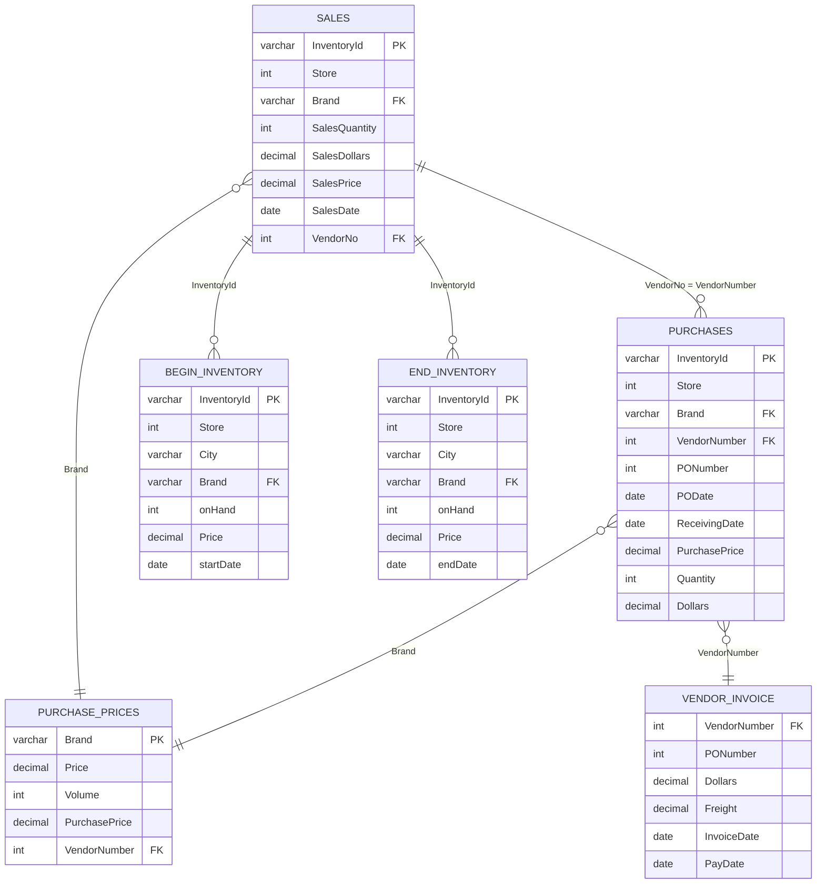

<p align="center">
  <h1 align="center">Vendor Performance Data & Business Analysis</h1>
  <p align="center">
    An end-to-end <strong>Data Analyst + Business Analyst</strong> case study analysing ~15.6 M rows of retail purchasing, sales, and inventory data to drive sourcing, pricing, and stock-management decisions.
  </p>
</p>

<p align="center">
  
  
  
  
  
  
</p>

---

## 📌 Business Problem

The merchandising and procurement teams need actionable answers to:

1. **Which vendors drive sales, profit, and procurement concentration?**
2. **Which brands combine low sales with enough margin headroom for a controlled promotion?**
3. **Where is ending inventory tying up the most retail value?**
4. **Does higher purchase volume actually coincide with better unit economics?**
5. **Is there a statistically significant difference in profit margins between top and low performers?**

---

## 📊 Key Findings

| KPI | Result | Business Relevance |
|-----|-------:|-------------------|
| Total Sales | **$452.06 M** | Commercial scale of the portfolio |
| Procurement Spend | **$321.90 M** | Addressable sourcing spend |
| Estimated Gross Profit | **$138.47 M** | Sales less estimated cost of sold units |
| Weighted Gross Margin | **30.66%** | Portfolio profitability on cost-matched sales |
| Top-10 Vendor Concentration | **65.33%** | Supplier dependency requiring contingency planning |
| Ending Inventory (Retail) | **$79.70 M** | Stock exposure at the year-end snapshot |

> **Note:** Profit is an estimate — COGS uses the weighted purchase cost for each vendor-brand. Inventory value uses the ending snapshot's retail price.

---

## 🏗️ Architecture



---

## 🗄️ Data Model (ERD)



**Inventory equation (reconciled at portfolio level):**

```
EndingUnits = BeginningUnits + PurchaseUnits − SalesUnits
```

---

## 📁 Project Structure

```
vendor-performance-data-analysis/
│
├── data/
│   ├── DATA_CARD.md              # Dataset documentation (schemas, relationships, quality notes)
│   ├── sales.csv                 # 12.8 M transaction rows (not tracked in git)
│   ├── purchases.csv             # 2.4 M procurement rows
│   ├── begin_inventory.csv       # 206 K starting inventory snapshot
│   ├── end_inventory.csv         # 224 K ending inventory snapshot
│   ├── purchase_prices.csv       # 12 K product-vendor catalog
│   └── vendor_invoice.csv        # 5.5 K vendor invoice records
│
├── notebooks/
│   ├── 01_data_exploration_and_preprocessing.ipynb    # Schema exploration, SQL aggregation, quality audit, preprocessing
│   └── 02_vendor_performance_and_business_analytics.ipynb  # EDA, business questions, stats tests, recommendations
│
├── scripts/
│   ├── config.py                 # Shared DB connection, logging, and path config
│   ├── ingest.py                 # Chunked CSV → SQLite ingestion with progress tracking
│   └── get_vendor_summary.py     # Build vendor_sales_summary analytical table
│
├── dashboard/
│   └── vendor_performance.pbix   # Power BI report (DAX measures, KPI cards, Pareto views)
│
├── images/                       # Generated analysis charts & visual assets
│
├── pyproject.toml                # Project metadata and dependencies (uv / pip)
├── LICENSE                       # MIT License
└── README.md                     # ← You are here
```

---

## 🔬 Analysis Notebooks

### Notebook 01 — Data Exploration & Preprocessing

- Connects to database and inspects all 6 tables
- Explores a single vendor end-to-end to understand data relationships
- Builds the **analytical base table** (`vendor_sales_summary`) by joining freight, purchases, and sales
- Identifies data quality issues (nulls, padding, type mismatches)
- Computes derived KPIs: Gross Profit, Profit Margin, Stock Turnover, Sales-to-Purchase Ratio

### Notebook 02 — Vendor Performance & Business Analytics

- Statistical profiling: distributions, boxplots, correlation heatmap
- **Promotional opportunity identification** — low-sales / high-margin brand quadrants
- **Vendor sales ranking** — top performers by revenue and purchase contribution
- **Procurement concentration** — Pareto analysis of top-10 vendor spend share
- **Bulk purchasing economics** — unit price analysis by order volume tier
- **Inventory diagnostics** — slow-moving stock and capital locked in unsold inventory
- **Confidence intervals** — 95% CI for profit margins of top vs. low performers
- **Hypothesis testing** — statistically significant difference in vendor-tier margins

---

## 🎯 Decisions Supported

- **Reduce supplier risk:** create contingency plans for vendors responsible for ~65% of procurement spend
- **Protect margin:** manage vendors on weighted margin dollars and margin rate, not unweighted averages
- **Target inventory action:** prioritize high-value, low-sell-through brands for reorder review and markdown tests
- **Test promotions:** pilot low-sales / high-margin brands with explicit margin guardrails
- **Avoid unsupported claims:** the data supports volume association analysis, not a causal claim about bulk discounts

---

## 🚀 Getting Started

### Prerequisites

- **Python 3.12+**
- **Power BI Desktop** (optional, for dashboard interaction)

> No external database server required — the project uses **SQLite**, which ships with Python.

### Setup

```bash
# 1. Clone the repository
git clone https://github.com/rohitkr8527/vendor-performance-data-analysis.git
cd vendor-performance-data-analysis

# 2. Create and activate virtual environment
python -m venv .venv
# Windows PowerShell:
.\.venv\Scripts\Activate.ps1
# macOS / Linux:
# source .venv/bin/activate

# 3. Install dependencies
uv sync            # recommended (reads pyproject.toml)
# or: pip install .
```

### Run the Pipeline

```bash
# Step 1: Ingest CSVs into SQLite (creates notebooks/inventory.db)
python -m scripts.ingest            # use --force to re-ingest all tables

# Step 2: Build the vendor summary analytical table
python -m scripts.get_vendor_summary

# Step 3: Open and run the notebooks in order
jupyter notebook
```

### Dashboard

Open `dashboard/vendor_performance.pbix` in Power BI Desktop and click **Refresh** to validate the KPI cards against the notebook results.

<!-- 
📸 DASHBOARD SCREENSHOTS
========================
To add dashboard images to this README:

1. Open vendor_performance.pbix in Power BI Desktop
2. Export screenshots: File → Export → Export as Image (or use Print Screen)
3. Save as:
   - images/dashboard.png         (main performance page)
   - images/dashboard_diagnostics.png  (diagnostic / inventory page)
4. Uncomment the image tags below:


-->

---

## 🛠️ Tech Stack

| Tool | Purpose |
|------|---------|
| **SQLite** | Lightweight embedded database with CTE, join, and aggregation support |
| **Python 3.12** | Data pipeline orchestration and statistical analysis |
| **pandas** | Data manipulation, aggregation, and cleaning |
| **SciPy** | Confidence intervals and hypothesis testing |
| **Matplotlib + Seaborn** | Statistical visualisations and distribution plots |
| **SQLAlchemy** | Database connectivity and ORM-free query execution |
| **Power BI** | Interactive dashboard with DAX measures and KPI cards |

---

## 📄 License

This project is licensed under the MIT License — see the [LICENSE](LICENSE) file for details.

---

## 👤 Author

**Rohit Kumar** · [`rohitkr8527`](https://github.com/rohitkr8527)

<!-- Add your links below -->
<!-- 🔗 [LinkedIn](https://linkedin.com/in/YOUR_LINKEDIN_HANDLE) -->
<!-- 🌐 [Portfolio](https://YOUR_PORTFOLIO_URL) -->
