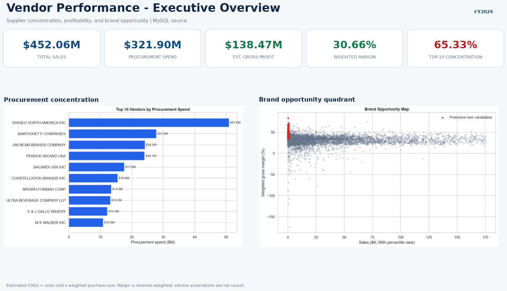
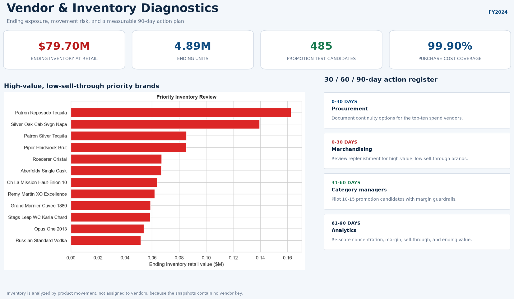

# Vendor Performance Data and Business Analysis

An end-to-end Data Analyst + Business Analyst case study using **MySQL, Python, and Power BI** to explore retail purchasing, sales, and inventory data and turn the findings into sourcing, pricing, and stock-management decisions.

## Executive snapshot

| KPI | Result | Decision relevance |
|---|---:|---|
| Total sales | **$452.06M** | Commercial scale of the portfolio |
| Procurement spend | **$321.90M** | Addressable sourcing spend |
| Estimated gross profit | **$138.47M** | Sales less estimated cost of sold units |
| Weighted gross margin | **30.66%** | Portfolio profitability on cost-matched sales |
| Top-10 vendor spend concentration | **65.33%** | Supplier dependency requiring contingency planning |
| Ending inventory at retail | **$79.70M** | Stock exposure at the year-end snapshot |

> Profit is an estimate: COGS uses the weighted purchase cost for each vendor-brand. Inventory value uses the ending snapshot's retail price. These definitions are intentionally explicit so the dashboard does not overstate accounting precision.





The PBIX source is retained in `dashboard/`. The explicit DAX measures and two-page implementation specification are documented in [`dashboard/MEASURES.md`](dashboard/MEASURES.md) so margin, concentration, and inventory cards cannot fall back to misleading implicit sums.

## Business problem

The merchandising and procurement teams need to know:

1. Which vendors drive sales, profit, and procurement concentration?
2. Which brands combine low sales with enough margin headroom for a controlled promotion?
3. Where is ending inventory tying up the most retail value?
4. Does higher purchase volume actually coincide with better unit economics?
5. Which actions should procurement and merchandising prioritize over the next 90 days?

## Decisions supported

- **Reduce supplier risk:** create contingency plans for the vendors responsible for roughly two-thirds of procurement spend.
- **Protect margin:** manage vendors on weighted margin dollars and margin rate, not unweighted averages.
- **Target inventory action:** prioritize high-value, low-sell-through brands for reorder review and markdown tests.
- **Test promotions:** pilot low-sales/high-margin brands with explicit margin guardrails instead of broad discounting.
- **Avoid unsupported claims:** the data supports volume association analysis, not a causal claim that bulk orders create a 72% discount.

## Analysis design

The reusable MySQL queries in [`sql/business_analysis.sql`](sql/business_analysis.sql) aggregate the 12.8M-row sales table inside MySQL and return compact analytical datasets. Python is used for statistical testing and presentation; Power BI uses explicit measures rather than implicit column sums.

Core definitions:

- **Estimated COGS:** sales quantity x weighted purchase cost for the same vendor-brand.
- **Weighted gross margin:** total estimated gross profit / total sales.
- **Sell-through:** sales units / (beginning inventory units + purchased units).
- **Inventory turnover:** sales units / average beginning and ending on-hand units.
- **Ending inventory exposure:** ending on-hand units x retail price.

The inventory equation reconciles exactly at portfolio level: beginning inventory plus purchases less sales equals ending inventory. Purchase costs cover **99.90% of sales**, and profitability excludes the unmatched 0.10% rather than assigning it a zero cost.

## Deliverables

```text
dashboard/vendor_performance.pbix            Power BI report
images/dashboard.png                         Dashboard preview
images/dashboard_diagnostics.png             Diagnostic-page preview
notebooks/01_data_quality_and_exploratory_analysis.ipynb  Data quality, distributions, trends, outliers, and correlations
notebooks/02_vendor_performance_business_analysis.ipynb   Business questions, statistical tests, and recommendations
sql/business_analysis.sql                    MySQL CTE and window-function analysis
reports/executive_summary.md                 Executive report source
reports/vendor_performance_report.tex         Reproducible LaTeX report source
Vendor Performance Report.pdf                 Shareable DA + BA report
```

## Reproduce the analysis

The MySQL database is assumed to be populated already; this workflow does **not** recreate it or ingest the CSV files again.

```powershell
python -m venv .venv
.\.venv\Scripts\Activate.ps1
pip install -r requirements.txt
Copy-Item .env.example .env
jupyter notebook
```

Add the existing MySQL credentials to `.env`, then run the two notebooks in order. Open `dashboard/vendor_performance.pbix`, update the MySQL credentials if prompted, and select **Refresh** to validate the headline cards against the notebooks.

## Tools

- **MySQL 8:** CTEs, joins, window functions, conditional aggregation
- **Python:** pandas, SciPy, Matplotlib, Seaborn
- **Power BI:** DAX measures, KPI cards, Pareto and diagnostic views

## Portfolio owner

**Rohit (`rohitkr8527`)**

The raw data and local credentials are intentionally excluded from version control.
